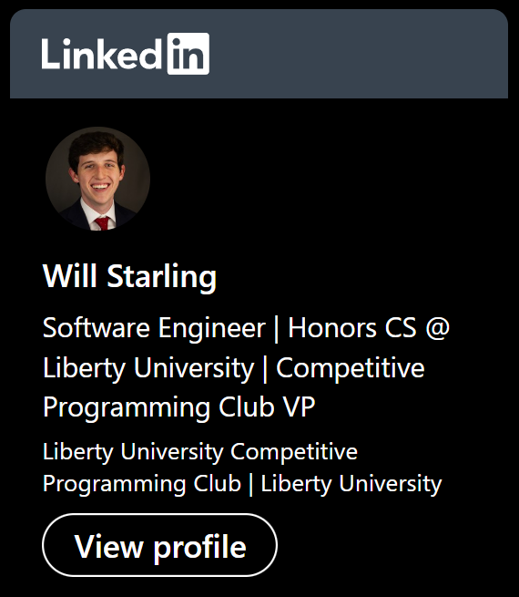

### Hi there 👋
- 🔭 I’m currently working on data structures & algorithms
- 🌱 I’m currently learning computer architecture & databases
- 🤔 I enjoy projects with automation and entrepreneurship
- 💬 Ask me about my faith in Jesus Christ!
 
 

    
    <!---->

 
 

## Connect with me on LinkedIn!

